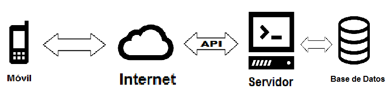
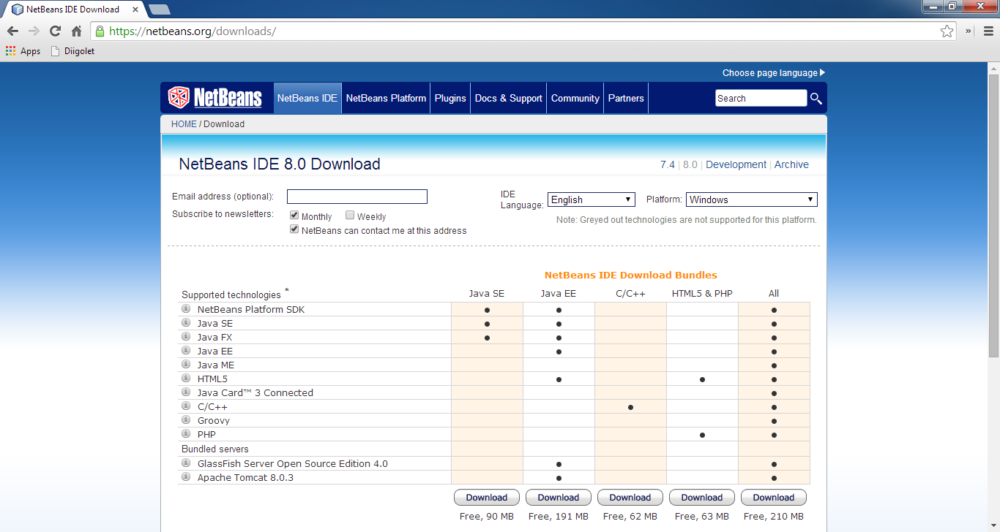
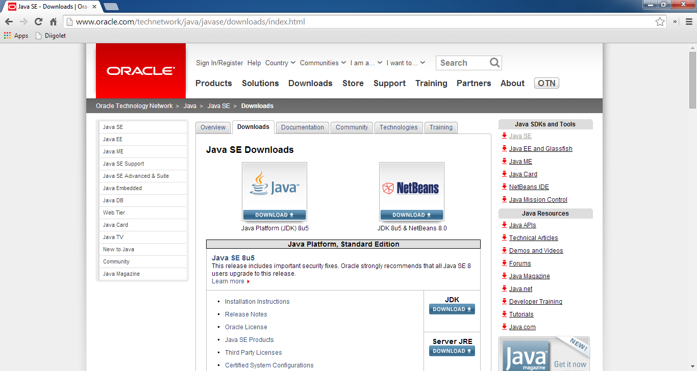

## Arquitectura de app móvil

## Instalación NetBeans IDE

* Si ya se tiene instalado el JDK (Java Development Kit) descargar solamente NetBeans IDE de <https://netbeans.org/downloads/> .

* Descargar el JDK y NetBeans IDE en paquete de <http://www.oracle.com/technetwork/java/javase/downloads/index.html> .

* Teniendo NetBeans IDE instalado asegurar que se tiene instalado el plugin Java Mobility.
